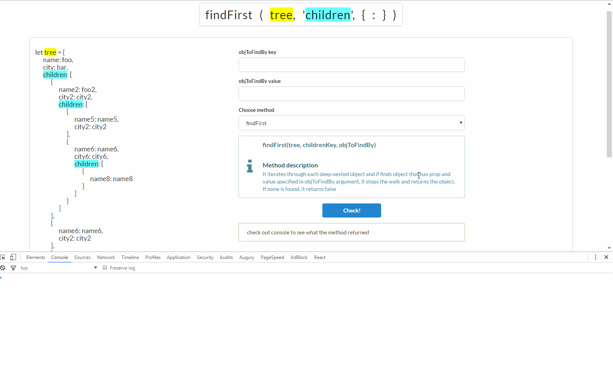
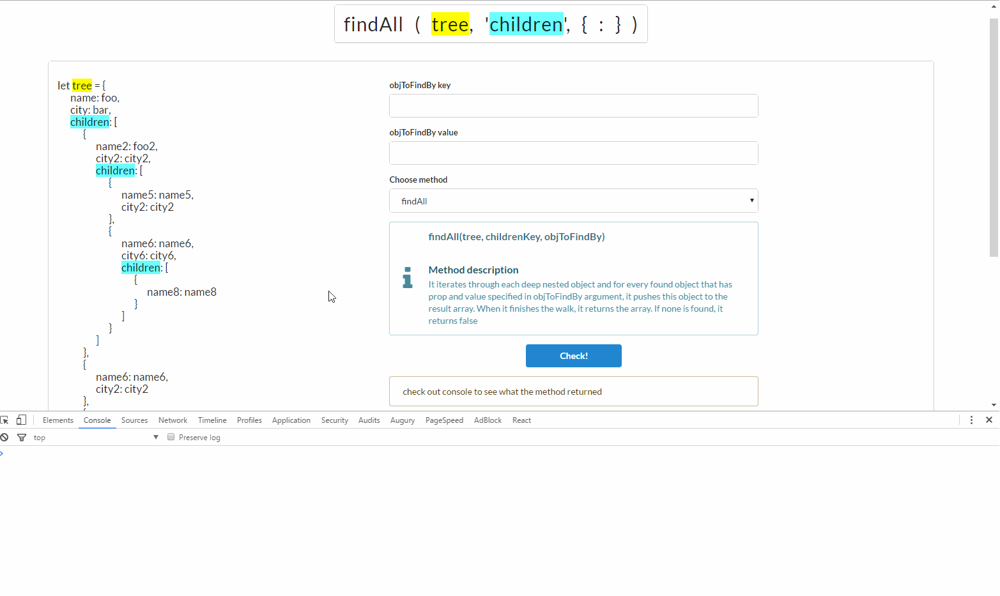
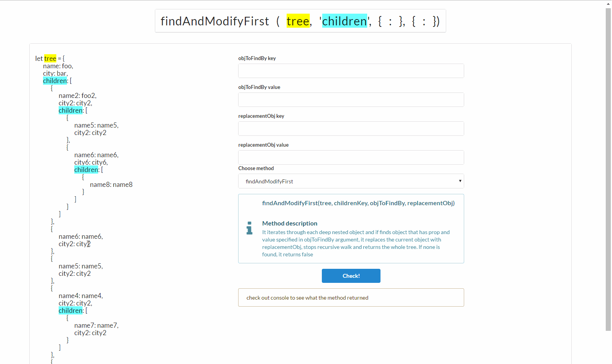
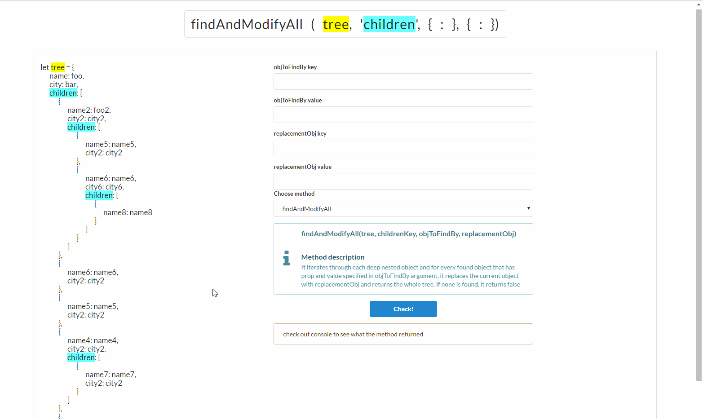
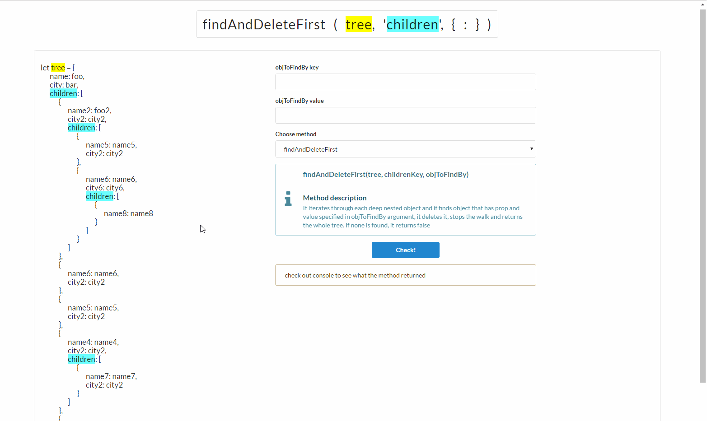
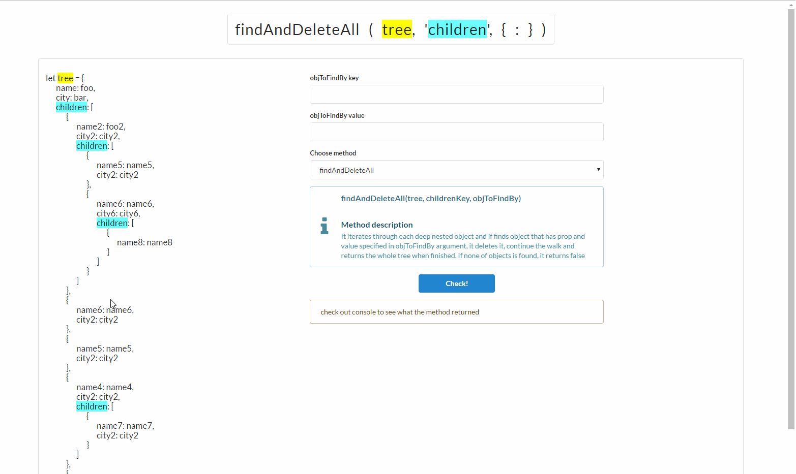

# obj-traverse

Small and lightweight library that enables you to traverse deep nested objects and edit them
<br/><br/>


## Getting Started

1. Run ```npm i obj-traverse --save```
2. Import library:<br/>
a) ```var objTraverse = require('obj-traverse/lib/obj-traverse');``` (look at 3a)<br/>
b) ES6: ```import * as objTraverse from 'obj-traverse/lib/obj-traverse';``` (look at 3a)<br/>
c) ES6: ``` import { findAll } from 'obj-traverse/lib/obj-traverse'; ``` (look at 3b)<br/>
3. Use it:<br/>
a) ``` objTraverse.findAll(...) ```<br/>
b) ``` findAll(...) ```<br/>


## Demo

You can visit http://dominik791.github.io/obj-traverse-demo and play with the library


## API

1. ```findFirst(tree, childrenKey, objToFindBy)```

   It iterates through each deep nested object and if finds object that has prop and value specified in ```objToFindBy```
   argument, it stops the walk and returns reference to this object. If none is found, it returns false.
   
   
   
   Please note that the method checks all children on current level and then it deepens to the next level - grandchildren.


2. ```findAll(tree, childrenKey, objToFindBy)```

   It iterates through each deep nested object and for every found object that has prop and value specified in
   ```objToFindBy``` argument, it pushes reference of this object to the result array. When it finishes the walk, it returns the array.
   If none is found, it returns false.
   
   
 
3. ```findAndModifyFirst(tree, childrenKey, objToFindBy, replacementObj)```
 
   It iterates through each deep nested object and if finds object that has prop and value specified in ```objToFindBy```
   argument, it replaces the current object with ```replacementObj```, stops recursive walk and returns reference to the root object.
   If none is found, it returns false.
   
   
  
   Please note that the method checks all children on current level and then it deepens to the next level - grandchildren.
   
   
4. ```findAndModifyAll(tree, childrenKey, objToFindBy, replacementObj)```
 
   It iterates through each deep nested object and for every found object that has prop and value specified in
   ```objToFindBy``` argument, it replaces the current object with ```replacementObj``` and returns reference to the root object.
   If none is found, it returns false.
   
   
   
   
5. ```findAndDeleteFirst(tree, childrenKey, objToFindBy)```
 
   It iterates through each deep nested object and if finds object that has prop and value specified in ```objToFindBy```
   argument, it deletes it, stops the walk and returns reference to the root object.
   If none is found, it returns false.
   
   
   
   Please note that the method checks all children on current level and then it deepens to the next level - grandchildren.
   
   
6. ```findAndDeleteAll(tree, childrenKey, objToFindBy)```
 
   It iterates through each deep nested object and if finds object that has prop and value specified in ```objToFindBy```
   argument, it deletes it, continue the walk and returns reference to the root object once finished.
   If none of objects is found, it returns false.
   
   
   
   
## Licence

MIT  
   
 
## Author

* Dominik Broj
